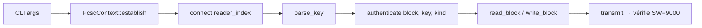

# Facts

> Utilitaire **Rust** minimaliste pour lire et écrire des cartes **MIFARE Classic 1K** via un lecteur **ACR122U** en PC/SC — sans `libnfc`, en APDU bruts.

[](https://www.rust-lang.org)
[](https://pcsclite.apdu.fr/)
[](#licence)
[](#prérequis)

---

## Table des matières

- [Présentation](#présentation)
- [Fonctionnalités](#fonctionnalités)
- [Prérequis](#prérequis)
- [Installation](#installation)
- [Démarrage rapide](#démarrage-rapide)
- [Commandes](#commandes)
  - [`list`](#list--lister-les-lecteurs-pcsc)
  - [`uid`](#uid--lire-luid)
  - [`read`](#read-block--lire-un-bloc)
  - [`write`](#write-block-hex--écrire-un-bloc)
  - [`dump`](#dump--dump-complet)
  - [`ndef-text`](#ndef-text--lire-et-décoder-un-record-text)
  - [`ui`](#ui--interface-graphique-slint)
- [Options globales](#options-globales)
- [Écrire un message NDEF Text à la main](#écrire-un-message-ndef-text-à-la-main)
- [Architecture](#architecture)
- [APDU de référence](#apdu-de-référence)
- [Dépannage](#dépannage)
- [Limites](#limites)
- [Licence](#licence)

---

## Présentation

`facts` parle directement à la carte en **APDU PC/SC** (classe `FF …`) interceptés par le firmware du lecteur. Le tout tient dans un seul fichier `src/main.rs` (~310 lignes) et sert à la fois :

- d'**outil pratique** pour lire/écrire des MIFARE Classic 1K formatées NFC ;
- de **référence lisible** pour le protocole ACR122U + MIFARE Classic ;
- de **base** pour étendre à d'autres familles de cartes (Ultralight, NTAG, DESFire).

> [!NOTE]
> D'autres lecteurs PC/SC (ex. **Alcor Link AK9563**) sont énumérés, mais les pseudo-APDU MIFARE dépendent du firmware. Sur AK9563 + JCOP, `FF CA` renvoie `SW=6E00` — voir [Limites](#limites).

## Fonctionnalités

- :mag: Énumération des lecteurs PC/SC
- :id: Lecture d'UID (4 ou 7 octets)
- :book: Lecture / écriture de blocs (16 octets) avec authentification clé A/B
- :package: Dump complet d'une MIFARE Classic 1K (64 blocs)
- :memo: Décodage automatique des records **NDEF Text**
- :desktop_computer: Interface graphique optionnelle via `facts ui` (Slint)

## Prérequis

| Composant         | Version / Note                          |
|-------------------|-----------------------------------------|
| Rust              | edition **2024**                        |
| `pcsc-lite`       | + service `pcscd` actif                 |
| Lecteur PC/SC     | **ACS ACR122U** (référence)             |

Sur **Fedora** :

```bash
sudo dnf install -y pkgconf pcsc-lite-devel pcsc-lite
sudo systemctl enable --now pcscd
```

Sur **Debian/Ubuntu** :

```bash
sudo apt install -y pkg-config libpcsclite-dev pcscd
sudo systemctl enable --now pcscd
```

## Installation

```bash
git clone <url-du-repo> facts
cd facts
cargo build --release
```

Binaire produit : `./target/release/facts`

## Démarrage rapide

```bash
# 1. Vérifier que le lecteur est détecté
facts list

# 2. Lire l'UID de la carte posée sur l'antenne
facts uid

# 3. Lire le bloc 4 (premier bloc de données) avec la clé B par défaut
facts --key-type b read 4

# 4. Décoder un record NDEF Text si la carte en contient un
facts --key-type b ndef-text
```

## Commandes

### `list` — lister les lecteurs PC/SC

```bash
$ facts list
[0] ACS ACR122U PICC Interface 00 00
[1] Alcor Link AK9563 01 00
```

L'index entre crochets sert pour `--reader N` (défaut `0`).

### `uid` — lire l'UID

```bash
$ facts --reader 0 uid
UID: 835A8F60
```

### `read <block>` — lire un bloc

```bash
$ facts --reader 0 --key-type b read 4
Bloc 04: 0317D1011354026672626F6E6A6F7572
```

Blocs valides : `0`–`63` pour une MIFARE Classic 1K.

### `write <block> <hex>` — écrire un bloc

Le hex doit faire **exactement 32 caractères** (16 octets), sans espaces :

```bash
$ facts --reader 0 --key-type b write 4 0317D1011354026672626F6E6A6F7572
Bloc 04 écrit.
```

> [!WARNING]
> N'écrivez **jamais** dans un bloc *trailer* (`block % 4 == 3`, soit 3, 7, 11, …, 63) sans connaître précisément les access bits et les clés à y inscrire — le secteur peut être **verrouillé définitivement**.

### `dump` — dump complet

```bash
$ facts --reader 0 --key-type b dump
00: 835A8F6036880400C844002000000015
01: 140103E103E103E103E103E103E103E1
...
63: 0000000000007F078840000000000000
```

Les blocs dont l'authentification échoue sont marqués `ERREUR (...)` — pratique pour identifier les secteurs dont la clé diffère.

### `ndef-text` — lire et décoder un record Text

```bash
$ facts --reader 0 --key-type b ndef-text
[fr] bonjour le monde
```

Le préfixe `[..]` donne le code langue déclaré. La lecture s'arrête au terminator `FE`.

Erreurs possibles :

| Cas                              | Message                                      |
|----------------------------------|----------------------------------------------|
| Aucun TLV `0x03` avant `FE`      | `Aucun message NDEF (...)`                   |
| Record non-Text (URI, MIME…)     | `Record non supporté (TNF=..., type=...)`    |
| Encodage UTF-16                  | `Encodage UTF-16 non supporté`               |
| Payload non UTF-8                | `Texte invalide (pas UTF-8)`                 |

### `ui` — interface graphique Slint

```bash
facts ui
```

Lance une fenêtre exposant les mêmes opérations (UID, lecture/écriture, dump, NDEF Text) sans avoir à composer les options en CLI. Le binaire release pèse ~24 Mo car il embarque le renderer Slint (femtovg + winit).

## Options globales

| Option        | Défaut          | Description                              |
|---------------|-----------------|------------------------------------------|
| `--reader N`  | `0`             | Index du lecteur si plusieurs branchés   |
| `--key HEX`   | `FFFFFFFFFFFF`  | Clé MIFARE 6 octets (12 hex)             |
| `--key-type`  | `a`             | `a` ou `b`                               |

> [!TIP]
> Sur les cartes **formatées NFC**, les secteurs de données s'authentifient typiquement avec la **clé B** `FFFFFFFFFFFF` (clé A non standard). Si une lecture échoue avec les valeurs par défaut, ajoutez `--key-type b`.

## Écrire un message NDEF Text à la main

Une MIFARE Classic 1K formatée NFC stocke les données NDEF à partir du **bloc 4**. Format d'un record Text :

```
03 LL                           ← NDEF Message TLV (LL = longueur record)
D1 01 PL 54                     ← record SR, type "T", payload PL octets
02 <lang1> <lang2>              ← status (UTF-8 + lang 2 chars) + code langue
<texte UTF-8…>                  ← payload texte
FE                              ← terminator TLV
```

Exemple — écrire **« bonjour le monde »** (langue `fr`) :

```bash
# Bloc 4 : 03 17 D1 01 13 54 02 66 72  b  o  n  j  o  u  r
facts --key-type b write 4 0317D1011354026672626F6E6A6F7572

# Bloc 5 : ' ' l  e  ' ' m  o  n  d  e  FE 00 00 00 00 00 00
facts --key-type b write 5 206C65206D6F6E6465FE000000000000

# Bloc 6 : effacer tout résidu après le terminator FE
facts --key-type b write 6 00000000000000000000000000000000
```

La carte est ensuite lisible par n'importe quelle app NFC standard (Android, NFC Tools…).

## Architecture



- **Un seul fichier**, un seul binaire (`src/main.rs`).
- Toute APDU passe par `transmit()`, qui exige `SW == 9000` et retire le status word.
- Une MIFARE Classic 1K = **64 blocs de 16 octets**, en **16 secteurs de 4 blocs**. Le bloc `N % 4 == 3` est un **trailer** (keys A/B + access bits).

## APDU de référence

| Opération              | APDU                                    |
|------------------------|-----------------------------------------|
| Get UID                | `FF CA 00 00 00`                        |
| Load Auth Key          | `FF 82 00 00 06 <K1..K6>`               |
| Authenticate Block     | `FF 86 00 00 05 01 00 <BLK> <KT> 00`    |
| Read Binary (16 B)     | `FF B0 00 <BLK> 10`                     |
| Update Binary          | `FF D6 00 <BLK> 10 <D1..D16>`           |

`KT` = `0x60` pour clé A, `0x61` pour clé B.

## Dépannage

<details>
<summary><b>L'authentification échoue (SW ≠ 9000) sur une lecture</b></summary>

1. Inverser le type de clé : `--key-type a` ↔ `--key-type b`.
2. Vérifier que la clé est bien `FFFFFFFFFFFF` (12 hex, valeur usine).
3. Confirmer que la carte est bien une **MIFARE Classic 1K** (pas Ultralight / NTAG / DESFire).

</details>

<details>
<summary><b><code>uid</code> renvoie <code>SW=6E00</code></b></summary>

Le lecteur ne **traduit pas** la pseudo-APDU `FF CA` — il la transmet telle quelle à la carte qui répond *class not supported*. Symptôme observé sur **Alcor Link AK9563** avec une JavaCard JCOP.

Confirmation : tester avec un **ACR122U** + carte MIFARE Classic 1K.

</details>

<details>
<summary><b><code>pcscd</code> ne démarre pas / aucun lecteur listé</b></summary>

```bash
sudo systemctl status pcscd
journalctl -u pcscd -n 50
```

Vérifier que `libpcsclite` est installé et que le lecteur USB est visible avec `lsusb`.

</details>

<details>
<summary><b><code>ndef-text</code> renvoie « Aucun message NDEF »</b></summary>

La carte ne contient pas de TLV `0x03` valide avant le terminator `0xFE`. Vérifier le contenu brut avec `facts read 4` — un tag NDEF commence typiquement par `03 LL …`.

</details>

## Limites

- Pas de gestion **MIFARE Ultralight, NTAG ou DESFire**.
- Pas de découverte automatique des clés (équivalent `mfoc`/`mfcuk`).
- Les commandes MIFARE reposent sur des **pseudo-APDU PC/SC** (classe `FF`) qui doivent être **traduites par le firmware** du lecteur. L'ACR122U les implémente toutes ; d'autres lecteurs CCID génériques les laissent passer telles quelles vers la carte (qui répond `SW=6E00`).
- Pas de suite de tests automatisés — vérification end-to-end avec une carte physique.

## Licence

Distribué sous licence **MIT**.
